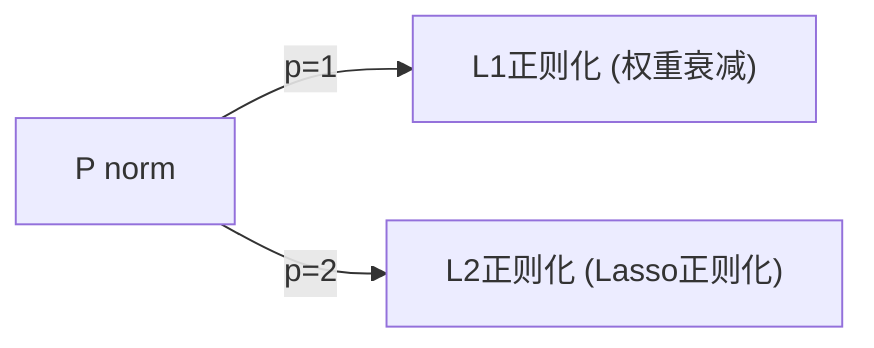

> 神经网络过拟合，就像是只会按照套路来做题的学生，抓不住题目的本质。一旦稍微改动一下题目，即使换汤不换药，也再做不对题目。过拟合可以通过**正则化和归一化（Regularization and normalization）** 来预防。下面将介绍这些防止神经网络过拟合的各种方法。

### Regularization and weight decay
正则化 和 权重衰减


为了说明权重衰减，我们不得不说一下**p范数（p-norm）惩罚**，这是一种正则化的方法。它长这个样子：

$$
E_w = \sum_{k}^{} ||w_k||^p
$$




**p范数（p-norm）惩罚**有“惩罚”二字，可以看出来，它放在损失函数中。权重越大，惩罚越大。

为什么要这么做呢？

在神经网络中，权重乘在输入上。每个神经元的输出，是其输入的加权和、通过激活函数之后的结果（一个数值）。那么，**权重的大小，就直接影响了输入特征对神经元输出的贡献**。

为了直观理解权重大小对于训练结果（拟合结果）的影响，我将

- 生成一些随机的点
- 设计一个复杂的神经网络，来进行拟合。因为复杂的神经网络学习能力更强
- 用L2正则化（也就是权重衰减），并通过**权重衰减系数**来控制是否让过拟合出现
	- 我们会对比不同的**权重衰减系数**下，神经网络过拟合的程度（权重衰减系数越大，越限制神经网络的过拟合，也就是说，神经网络越不容易过拟合）


代码如下：
```python
import numpy as np
import tensorflow as tf
from tensorflow.keras.models import Sequential
from tensorflow.keras.layers import Dense
from tensorflow.keras.regularizers import l2
import matplotlib.pyplot as plt


# 随机生成正弦函数数据点
np.random.seed(0)
x = np.linspace(0, 2 * np.pi, 50)
y = x*x + 2*np.random.randn(50)

# 定义不同的L2正则化系数
l2_regularizers = [0.0, 0.01, 0.1, 1.0]

# 存储每个模型的拟合结果
predictions = []

for l2_reg in l2_regularizers:
    # 构建复杂的神经网络模型
    model = Sequential([
        Dense(64, activation='relu', kernel_regularizer=l2(l2_reg), input_shape=(1,)),
        Dense(64, activation='relu', kernel_regularizer=l2(l2_reg)),
        Dense(64, activation='relu', kernel_regularizer=l2(l2_reg)),
        Dense(1)
    ])

    # 编译模型
    optimizer = tf.keras.optimizers.Adam(learning_rate=0.01)
    model.compile(optimizer=optimizer, loss='mse')

    # 训练模型
    model.fit(x, y, epochs=200, batch_size=10, verbose=0)

    # 预测拟合结果
    x_pred = np.linspace(0, 2 * np.pi, 1000)
    y_pred = model.predict(x_pred)
    predictions.append(y_pred)

# 绘制原始数据和拟合曲线
plt.figure(figsize=(10, 6))
plt.scatter(x, y, label='Original Data', color='blue')

for i, y_pred in enumerate(predictions):
    plt.plot(x_pred, y_pred, label=f'L2 Regularizer: {l2_regularizers[i]}')

plt.xlabel('x')
plt.ylabel('y')
plt.title('Neural Network Fitting with Different L2 Regularization')
plt.legend()
plt.show()
```

